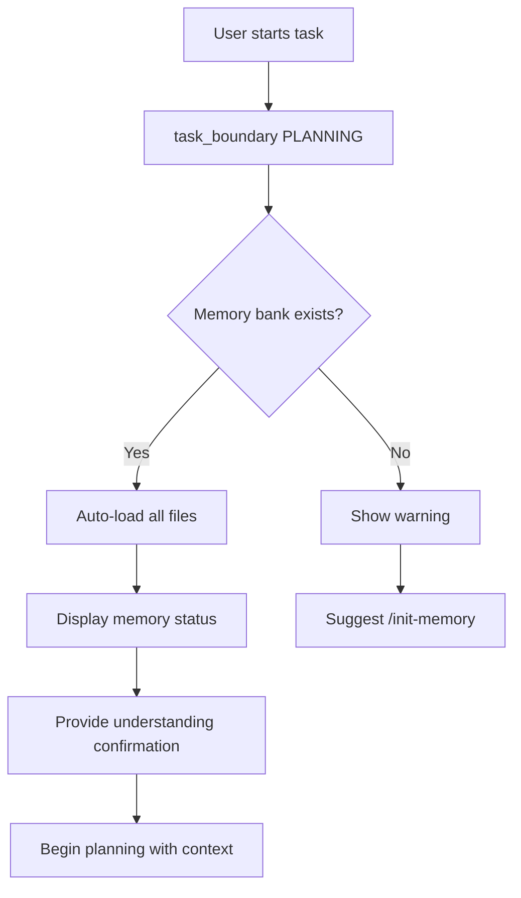

# Memory Bank System for Antigravity

[](https://github.com/feodus/antigravity-memory-bank/releases)
[](https://opensource.org/licenses/MIT)
[](https://github.com/feodus/antigravity-memory-bank/stargazers)

Comprehensive documentation and templates for implementing the Memory Bank system in Antigravity-powered projects.

## 📁 Repository Structure

```
kilocode-antigravity_rules/
├── antigravity-memory-bank.md   # Main rule file for Antigravity
├── memory-bank.md                # Original Kilo Code rules (reference)
├── workflows/                    # Workflow files for projects
│   ├── init-memory.md           # Initialize memory bank
│   └── update-memory.md         # Update memory bank
├── templates/                    # Template files for memory bank
│   ├── project-brief.md
│   ├── product-vision.md
│   ├── context.md
│   ├── architecture.md
│   ├── tech-stack.md
│   └── common-tasks.md
└── README.md                     # This file
```

## 🚀 Quick Start

### For Antigravity Configuration

1. **Add Memory Bank rules to Antigravity**:

   - Copy content from `antigravity-memory-bank.md`
   - Add to your Antigravity custom rules or system configuration

2. **The rule enables**:
   - ✅ Automatic memory loading when entering PLANNING mode
   - ✅ Memory status markers
   - ✅ Workflows for initialization and updates
   - ✅ Pattern documentation

### For Projects Using Memory Bank

1. **Copy workflow files** to your project:

   ```bash
   mkdir -p .agent/workflows
   cp workflows/init-memory.md .agent/workflows/
   cp workflows/update-memory.md .agent/workflows/
   ```

2. **Initialize memory bank**:

   - Use slash command: `/init-memory`
   - Agent will analyze project and create `.agent/memory/` structure

3. **Work normally**:
   - Memory bank auto-loads when you start tasks
   - Update when needed: "update memory bank"

## 📖 Core Concepts

### Memory Bank Structure

Projects using memory bank will have:

```
your-project/
└── .agent/
    ├── memory/                    # Memory bank (persistent)
    │   ├── docs/                  # Documentation & Guides
    │   ├── project-brief.md       # Manual - project foundation
    │   ├── product-vision.md      # Auto - product goals
    │   ├── context.md             # Auto - current state
    │   ├── architecture.md        # Auto - system design
    │   ├── tech-stack.md          # Auto - technologies
    │   └── patterns/
    │       └── common-tasks.md    # Auto - repetitive tasks
    └── workflows/                 # Workflows (from templates)
        ├── init-memory.md
        └── update-memory.md
```

### How It Works



### Memory Status Markers

**Active memory**:

```
🧠 Project Memory: Active
   - Brief: ✓ E-commerce platform
   - Product: ✓ Marketplace for makers
   - Context: ✓ Payment integration
   - Architecture: ✓ Microservices
   - Tech Stack: ✓ Next.js, PostgreSQL
   - Patterns: ✓ 3 tasks
```

**Not initialized**:

```
⚠️ Project Memory: Not initialized
   💡 Tip: Run /init-memory
```

## 🔄 Workflows

### Initialize Memory Bank (`/init-memory`)

**When**: Starting new project or adding memory bank to existing project

**What it does**:

1. Analyzes entire project comprehensively
2. Creates `.agent/memory/` structure
3. Populates all core files with findings
4. Requests user review

**Duration**: ~5-10 minutes depending on project size

**Critical**: Thorough initialization = better future interactions

### Update Memory Bank (`update memory bank`)

**When**:

- After significant changes
- Discovering new patterns
- User explicitly requests
- Before major refactoring

**What it does**:

1. Reviews ALL memory files
2. Updates outdated information
3. Documents new patterns
4. Updates current context

**Focus**: Always updates `context.md`, others as needed

### Add Task (`add task`)

**When**: After completing repetitive task that might recur

**What it does**:

1. Documents task in `patterns/common-tasks.md`
2. Captures files, steps, gotchas
3. Provides example implementation

**Examples**:

- Adding new model support
- Creating new API endpoints
- Adding feature following pattern

## 📝 File Descriptions

### Core Files

| File                | Purpose            | Updated By             | Frequency                 |
| ------------------- | ------------------ | ---------------------- | ------------------------- |
| `project-brief.md`  | Foundation & scope | **Manual** (developer) | Rarely                    |
| `product-vision.md` | Product goals      | Auto (agent)           | Occasionally              |
| `context.md`        | Current state      | Auto (agent)           | **Frequently**            |
| `architecture.md`   | System design      | Auto (agent)           | When architecture changes |
| `tech-stack.md`     | Technologies       | Auto (agent)           | When dependencies change  |
| `common-tasks.md`   | Repetitive tasks   | Auto (agent)           | When patterns emerge      |

### Key Characteristics

**`project-brief.md`** (Special):

- Created manually by developer
- Agent may suggest updates but doesn't edit directly
- Source of truth for scope and requirements
- Takes precedence in conflicts

**`context.md`** (Most Dynamic):

- Updates most frequently
- Tracks current work focus
- Documents recent changes
- Lists immediate next steps
- Must stay SHORT and FACTUAL

## 🎯 Best Practices

### For Developers

1. **Review initialization**: Always review memory bank after `/init-memory`
2. **Maintain brief**: Keep `project-brief.md` updated manually
3. **Update context**: Update memory bank after significant work
4. **Document patterns**: Use "add task" for repetitive workflows

### For Agents

1. **Auto-load always**: Load memory when entering PLANNING mode
2. **Show status**: Always display memory status marker
3. **Confirm understanding**: Brief 1-2 sentence project summary
4. **Update strategically**: Focus on `context.md`, update others as needed
5. **Suggest wisely**: Only suggest updates for significant changes

## 🔧 Integration with Antigravity

### Task Flow Integration

```
User Request → New Task
         ↓
task_boundary(PLANNING)
         ↓
Auto-load .agent/memory/*
         ↓
Display 🧠 Memory Status
         ↓
Brief understanding confirmation
         ↓
Create implementation_plan.md
         ↓
         ↓
task_boundary(EXECUTION)
         ↓
Follow patterns from common-tasks.md
         ↓
         ↓
task_boundary(VERIFICATION)
         ↓
Update context.md
         ↓
Suggest memory update if significant
```

### Automatic Features

✅ **Auto-load on PLANNING**: No user confirmation needed  
✅ **Status markers**: Visual feedback on memory state  
✅ **Context awareness**: Agent understands project before planning  
✅ **Pattern following**: Uses documented workflows automatically  
✅ **Smart suggestions**: Recommends updates and task documentation

## 📚 Templates

This repository includes templates for all memory bank files:

- `templates/project-brief.md` - Project foundation template
- `templates/product-vision.md` - Product vision template
- `templates/context.md` - Current context template
- `templates/architecture.md` - Architecture documentation template
- `templates/tech-stack.md` - Technology stack template
- `templates/common-tasks.md` - Common tasks template with example

Templates are used automatically during initialization but can be referenced for manual creation.

## 🔍 Examples

### Example Memory Status (Active)

```
🧠 **Project Memory**: Active
   - Brief: ✓ SaaS analytics dashboard for e-commerce
   - Product: ✓ Real-time sales tracking and insights
   - Context: ✓ Implementing webhook system for Shopify integration
   - Architecture: ✓ Event-driven microservices with Redis pub/sub
   - Tech Stack: ✓ Next.js 14, Node.js, PostgreSQL, Redis, Shopify API
   - Patterns: ✓ 5 documented tasks

I understand we're building a SaaS analytics dashboard. Currently implementing the webhook system for Shopify integration to capture real-time sales events.
```

### Example Task Documentation

```markdown
## Add New Integration Provider

**Last performed**: 2025-12-03

### Files to Modify

- `/src/integrations/providers/[provider].ts` - Provider implementation
- `/src/integrations/registry.ts` - Register new provider
- `/src/types/integrations.ts` - Add provider types
- `/tests/integrations/[provider].test.ts` - Add tests

### Steps

1. Create provider file implementing `IntegrationProvider` interface
2. Add authentication flow
3. Implement webhook handlers
4. Register in provider registry
5. Add comprehensive tests
6. Update documentation

### Important Notes

- ⚠️ All providers must implement rate limiting
- ⚠️ Webhooks must verify signature
- 💡 Use existing Shopify provider as reference

### Example Implementation

[Code snippet showing provider structure]
```

## ❓ FAQ

**Q: When should I initialize memory bank?**  
A: At project start or when adding to existing project. One-time setup.

**Q: How often should memory bank be updated?**  
A: After significant changes, new patterns, or before major refactoring. Not every commit!

**Q: What if memory bank files conflict?**  
A: `project-brief.md` takes precedence. Agent will note conflicts to user.

**Q: Can I edit memory bank files manually?**  
A: Yes! Especially `project-brief.md` which should be maintained manually. Others can be edited but agent will overwrite during updates.

**Q: Does memory persist between conversations?**  
A: Yes! Memory bank files in `.agent/memory/` persist at project level.

**Q: What's the difference from task.md artifact?**  
A: `task.md` is per-conversation (temporary). Memory bank is per-project (permanent).

## 🚧 Troubleshooting

**Memory not loading**:

- Check `.agent/memory/` folder exists
- Verify files are valid markdown
- Ensure you're in PLANNING mode

**Status showing "Partial"**:

- Some core files are missing
- Run `/init-memory` to complete
- Or create missing files manually

**Outdated information**:

- Run "update memory bank"
- Review and update `context.md` especially

## 📄 License

This implementation is adapted from Kilo Code's Memory Bank concept for use with Antigravity agent.

---

**Last updated**: 2025-12-03
