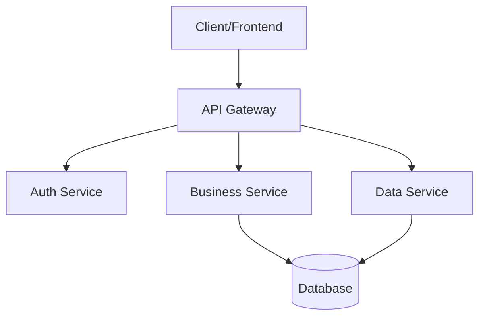
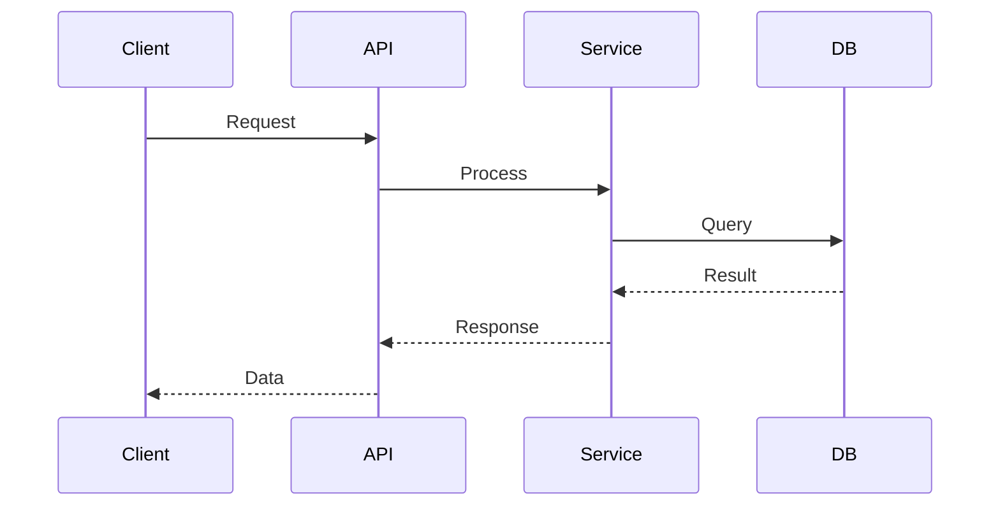

# Architecture

## System Overview

[High-level description of the system architecture - e.g., "Microservices architecture with React frontend, Node.js backend services, and PostgreSQL database"]

## Key Components

### Frontend

- **Location**: [`/src/client`](file:///path/to/src/client)
- **Description**: [What it does]
- **Technology**: [Framework/library used]
- **Key files**:
  - [`App.tsx`](file:///path/to/App.tsx) - Main application component
  - [`/components`](file:///path/to/components) - Reusable components

### Backend

- **Location**: [`/src/server`](file:///path/to/src/server)
- **Description**: [What it does]
- **Technology**: [Framework used]
- **Key files**:
  - [`server.ts`](file:///path/to/server.ts) - Entry point
  - [`/routes`](file:///path/to/routes) - API endpoints
  - [`/services`](file:///path/to/services) - Business logic

### Database

- **Location**: [`/database`](file:///path/to/database)
- **Description**: [Database setup]
- **Technology**: [Database system]
- **Key files**:
  - [`schema.sql`](file:///path/to/schema.sql) - Database schema
  - [`/migrations`](file:///path/to/migrations) - Migration files

## Design Patterns

### [Pattern 1 Name]

- **Where**: [Which components use this]
- **Why**: [Reason for using this pattern]
- **Example**: [Code example or file reference]

### [Pattern 2 Name]

- **Where**: [Which components use this]
- **Why**: [Reason for using this pattern]
- **Example**: [Code example or file reference]

## Component Relationships

[Describe how major components interact with each other]

## Data Flow

[Describe how data flows through the system]

1. [Data entry point]
2. [Processing step]
3. [Storage/persistence]
4. [Retrieval/display]

## Key Directories

| Directory                             | Purpose   | Key Files   |
| ------------------------------------- | --------- | ----------- |
| [`/src`](file:///path/to/src)         | [Purpose] | [Key files] |
| [`/tests`](file:///path/to/tests)     | [Purpose] | [Key files] |
| [`/config`](file:///path/to/config)   | [Purpose] | [Key files] |
| [`/scripts`](file:///path/to/scripts) | [Purpose] | [Key files] |

## Critical Implementation Paths

### [Critical Path 1 - e.g., "User Authentication"]

**Files involved**:

1. [`auth.controller.ts`](file:///path/to/auth.controller.ts) - Entry point
2. [`auth.service.ts`](file:///path/to/auth.service.ts) - Business logic
3. [`user.model.ts`](file:///path/to/user.model.ts) - Data model

**Flow**: [Describe the flow]

### [Critical Path 2 - e.g., "Payment Processing"]

**Files involved**:

1. [File 1]
2. [File 2]

**Flow**: [Describe the flow]

## Technical Decisions

### [Decision 1]

- **Decision**: [What was decided]
- **Rationale**: [Why this decision was made]
- **Alternatives considered**: [Other options]
- **Trade-offs**: [Pros and cons]

### [Decision 2]

- **Decision**: [What was decided]
- **Rationale**: [Why this decision was made]

## Deployment Architecture

[Describe how the application is deployed - e.g., containerization, cloud services, etc.]

---

**Last updated**: [YYYY-MM-DD]
